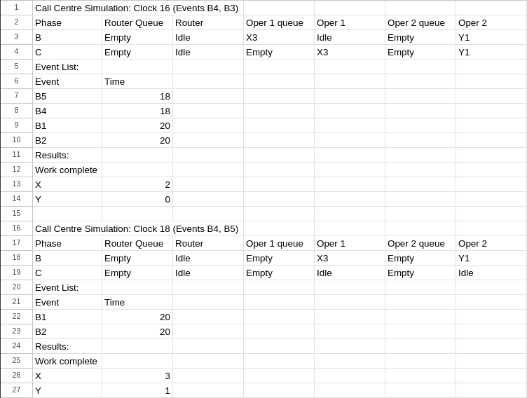

# Orientaatiotehtävä 2
1. 
> a) Arrival event needs to generate a new arrival event for the further arrival events, so it won't get clogged.

> b) In the start of the service, there should be generated arrival event.

4.
 
